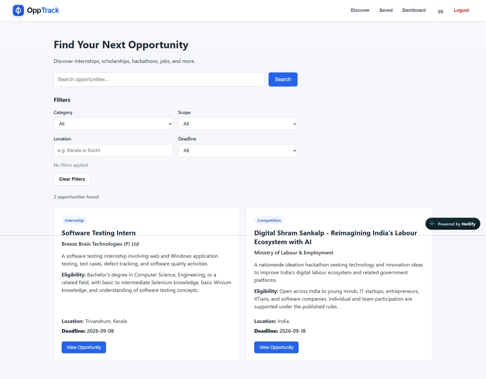
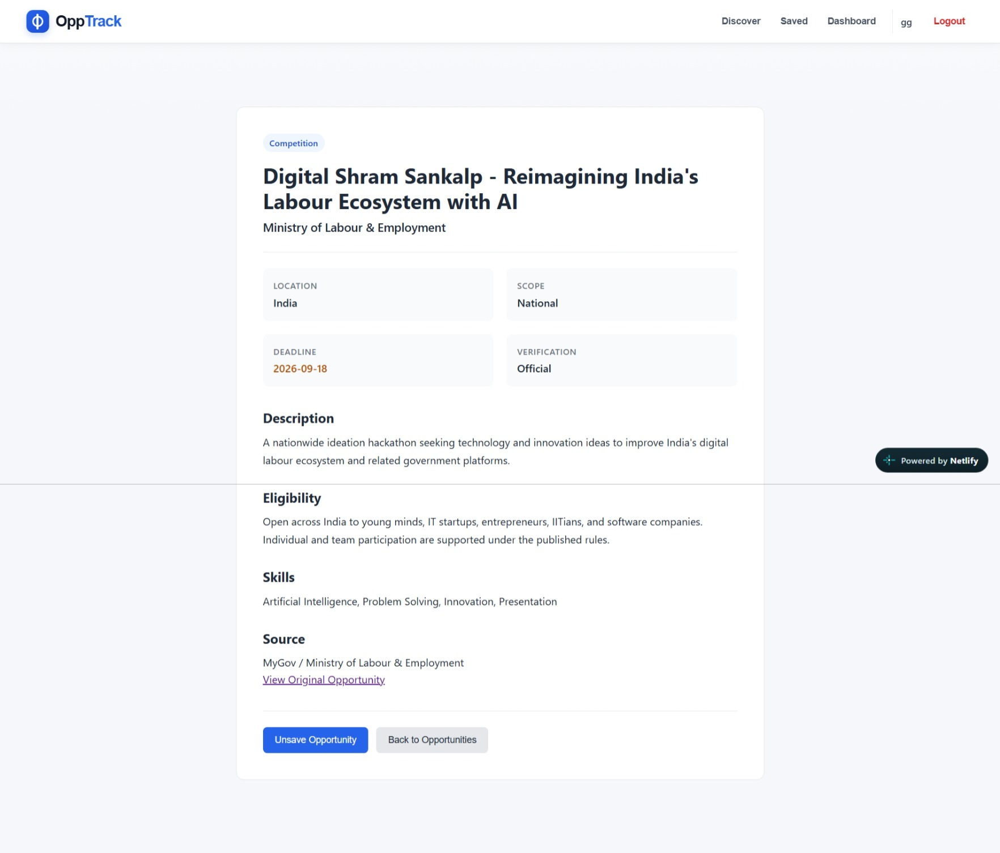
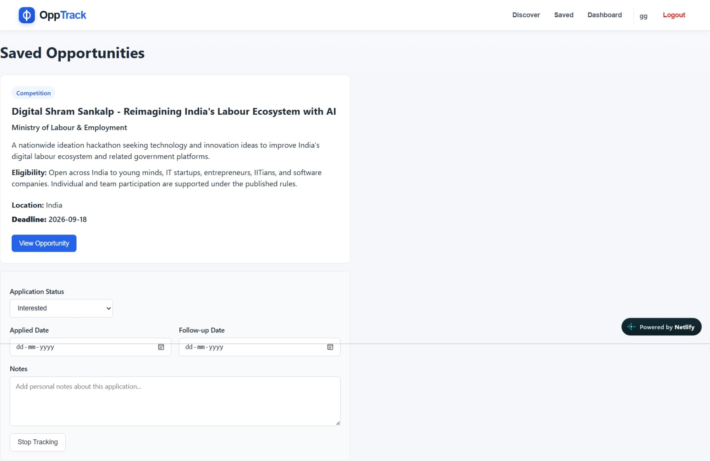
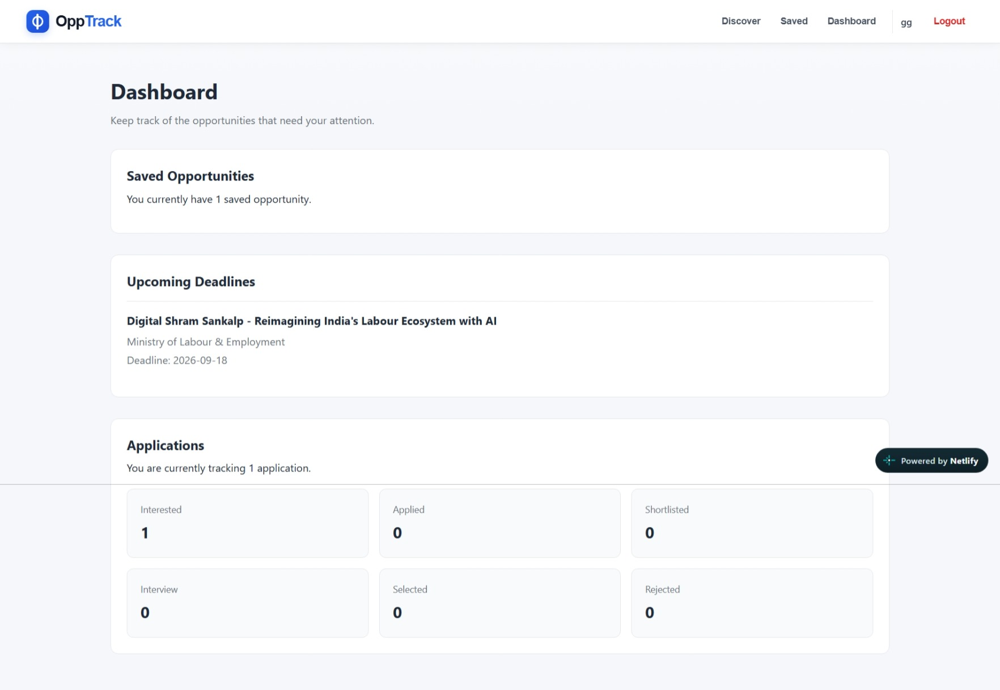
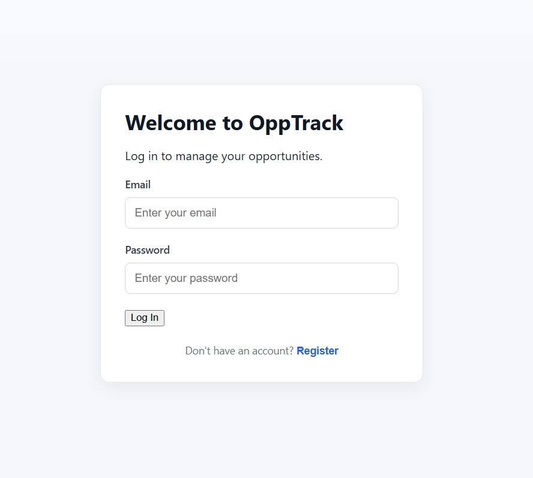
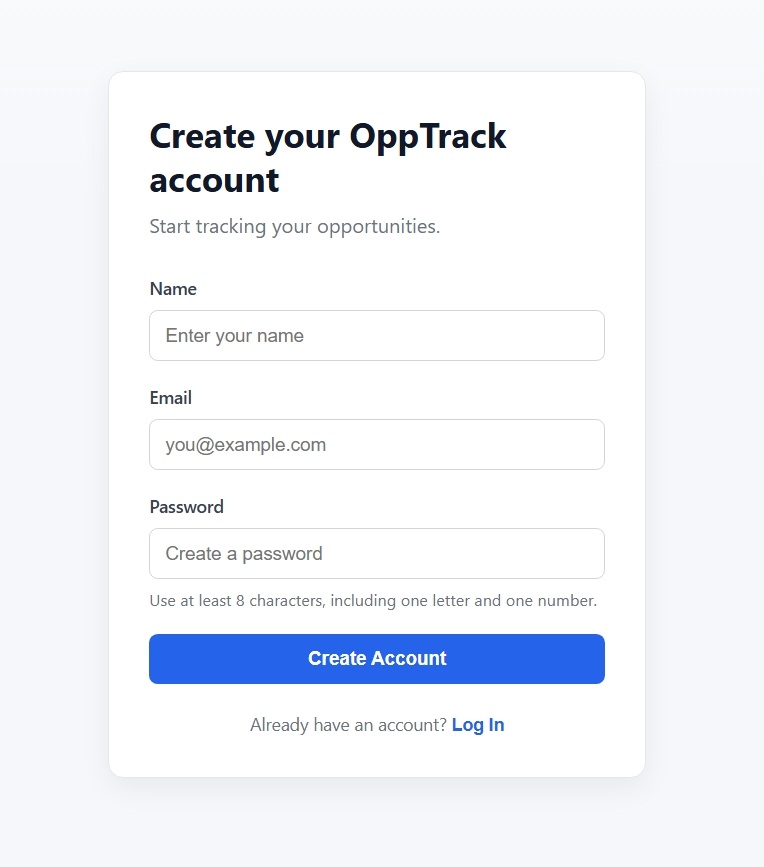

# OppTrack

A full-stack Student Opportunity Tracker built to help students discover, save, and track internships, scholarships, hackathons, competitions, jobs, workshops, and other opportunities.

OppTrack was built as a practical portfolio project using React, Node.js, Express, and PostgreSQL.

## Features

- Browse and search opportunities
- Filter by category, scope, location, and deadline urgency
- View detailed opportunity information
- Save and unsave opportunities
- Track applications with different statuses
- Record applied dates, notes, and follow-up dates
- Dashboard for tracking application progress
- User registration and login
- Session-based authentication
- User-specific saved opportunities and applications
- Responsive interface for desktop and smaller screens

## Screenshots

### Discover



### Opportunity Details



### Saved Opportunities



### Dashboard



### Login



### Register



## Tech Stack

**Frontend**
- React
- JavaScript
- Vite
- CSS

**Backend**
- Node.js
- Express.js

**Database**
- PostgreSQL
- Neon PostgreSQL

**Deployment**
- Netlify
- Render

**Development**
- Git
- GitHub
- pgAdmin 4

## Architecture

```text
User
  ↓
Netlify
React + Vite Frontend
  ↓ HTTPS API Requests
Render
Node.js + Express Backend
  ↓ SQL
Neon PostgreSQL
The frontend communicates with the backend through REST API endpoints. The backend handles authentication, authorization, application tracking, saved opportunities, and database operations.
The frontend never connects directly to PostgreSQL.
Authentication
OppTrack uses session-based authentication.
Passwords are securely hashed using Node.js scrypt
Random session tokens are generated after login
Only a SHA-256 hash of the session token is stored in the database
The session token is sent through an HTTP-only cookie
Protected routes verify the session before accessing user data
User-specific database queries use the authenticated user's ID

Live Application
Frontend:
https://nimble-mermaid-650643.netlify.app⁠�
Backend API:
https://opptrack-backend.onrender.com/api⁠�
Local Development
1. Clone the repository
git clone https://github.com/arclegit/OppTrack.git
cd OppTrack
2. Install dependencies
npm install
3. Configure environment variables
Create the required environment files for the frontend and backend.
The backend requires the PostgreSQL connection configuration and authentication-related environment variables.
The frontend uses:
VITE_API_URL=http://localhost:5000/api
4. Start the backend
npm start
5. Start the frontend
npm run dev
The application will then be available through the local Vite development server.
Documentation
Detailed project documentation is available in the docs directory.
Architecture
Authentication
Database
API Reference
Deployment
Development
Security
Project Scope
OppTrack is designed as an opportunity discovery and tracking system.
It does not act as an application portal, recruitment company, authenticity guarantee, or replacement for opportunity providers. Users are directed to the original provider URLs when applying.
Project Status
OppTrack is currently deployed and functional, with real opportunity data and production authentication.
Further improvements can include richer data ingestion, additional opportunity sources, stronger filtering, notifications, and other features as the project evolves.
Built as a BCA portfolio project.
Documentation prepared with AI assistance and reviewed by the project author.